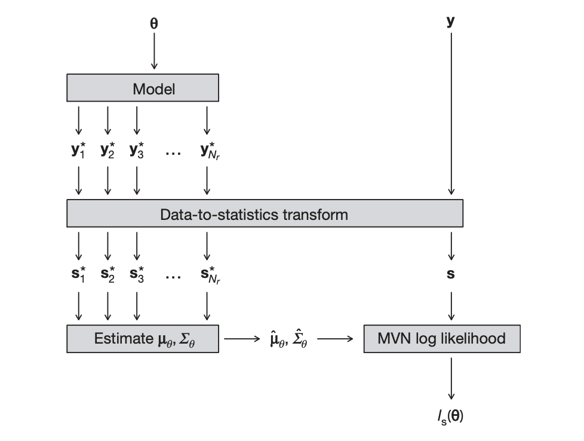

```{r include = F}
knitr::opts_chunk$set(
    echo    = F,
    warning = F,
    message = F,

    # Hide the "##" from code output
    comment = NULL,

    fig.height = 6.5
)

source("bsl.R")
```

# Original paper(s)

- Wood, S. N. (2010). Statistical inference for noisy nonlinear ecological dynamic systems. *Nature*.
    - Introduced *synthetic likelihood* technique in a frequentist setting
- Price, L. F., Drovandi, C. C., Lee, A., & Nott, D. J. (2018). Bayesian synthetic likelihood. *Journal of Computational and Graphical Statistics*.
    - Extended Wood (2010) to *Bayesian synthetic likelihood* technique in a Bayesian setting

# Motivating the synthetic likelihood

At a high level, the synthetic likelihood is a replacement for an intractable true likelihood.
Synthetic likelihood originates in a *frequentist setting*, when the likelihood function is too irregular to easily maximize (analytically or numerically).
Maximizing the synthetic likelihood yields a point estimator for your parameters.

It is trivial to extend this to a Bayesian setup by placing a prior on the parameters, obtaining a posterior distribution of parameters instead of point estimates.

The core requirement of the synthetic likelihood method is that we can still generate samples from the true likelihood.

Upcoming motivating example from the paper: Ricker population model.

(Note that the paper does not thoroughly address the concerns with this motivating example.
We attempt to seek an understanding ourselves.)

# Motivating the synthetic likelihood

In the Ricker model, $N_t$ models the time course of a population, where
\begin{align*}
N_0 &= 1 \\
N_t &= r N_{t-1} \mathrm{e}^{- N_{t-1} + e_{t-1}} \\
e_t &\overset{\text{iid}}{\sim} \mathcal{N}(0, \sigma^2)
\end{align*}

In other words, $N_t | N_{t-1} \sim LogNormal(\log N_{t-1} + \log r - N_{t-1}, \sigma^2)$.

Additionally, suppose $N_t$ is not actually observed, but a sample from the population $Y_t | N_t \sim Poisson(\phi N_t)$ is observed.

Our parameters are thus:
$r$, a population growth rate parameter;
$\sigma$, controlling random noise; and
$\phi$, a scaling parameter for sampling from the population.

# Motivating the synthetic likelihood

To do Bayesian inference, we need:

$$p(r, \sigma, \phi | \bm{Y}) \propto p(r, \sigma, \phi) p(\bm{Y} | r, \sigma, \phi)$$.

Can we obtain the likelihood $p(\bm{Y} | r, \sigma, \phi)$ required?

# Motivating the synthetic likelihood

Let $\bm{\theta} = (r, \sigma, \phi)$.
The joint likelihood with observed and latent variables is easier to work out:

\begin{align*}
p(\bm{Y}, \bm{N} | \bm{\theta})
&= p(\bm{N} | \bm{\theta}) p(\bm{Y} | \bm{N}, \bm{\theta}) \\
&= p(N_1 | \bm{\theta}) \prod_{t = 2}^n p(N_t | N_{t-1}, \bm{\theta}) \prod_{t = 1}^n p(Y_t | N_t, \bm{\theta}) \\
&= LogNormal(N_1; ...) \prod_{t = 2}^n LogNormal(N_t; ...) \prod_{t = 1}^n Poisson(Y_t; ...)
\end{align*}

# Motivating the synthetic likelihood

We would need to marginalize over all $N_t$:

$$
p(\bm{Y} | r, \sigma, \phi) =
\int_{N_1} ... \int_{N_n} p(\bm{Y}, \bm{N} | \bm{\theta}) \, dN_1 ... dN_n
$$

This is expensive, in part because the number of integrals grows with the number of data points observed.

Alternatively, instead of having the posterior $p(r, \sigma, \phi | \bm{Y})$, we could also try to do inference on the latent population variables: $p(N_1, ..., N_n, r, \sigma, \phi | \bm{Y})$.

However, this would require the dimension of Metropolis-Hastings proposals to grow with the number of observed data points too (proposing values of each $N_t$).

(We think this is undesirable; the paper does not address the drawbacks of traditional MCMC for this model over using the synthetic likelihood.)

# Bayesian synthetic likelihood

What if, instead of targeting the posterior $p(\bm{\theta} | \bm{Y})$ in our MCMC, we target:

$$p(\bm{\theta} | \bm{s_Y})$$

where $\bm{s_Y}$ is a vector of summary statistics for $\bm{Y}$, eg. the mean, quantiles, etc.

This would use a so-called "synthetic likelihood" $p(\bm{s_Y} | \bm{\theta})$ in place of the true likelihood $p(\bm{Y} | \bm{\theta})$.

(This is similar to obtaining a maximum synthetic likelihood estimator instead of an MLE in the frequentist setting.
The MSLE doesn't necessarily approximate the MLE; it is an alternative.)

# Bayesian synthetic likelihood

Of course, depending on your choice of statistics, this *synthetic likelihood* may not be tractable either.
This method consequently makes a normality assumption:

$$\bm{s_Y} | \bm{\theta} \sim \mathcal{N}(\bm{\mu_\theta}, \bm{\Sigma_\theta})$$

where $\bm{\mu}$ and $\bm{\Sigma}$ change with $\theta$.

Ideally, your statistics truly are normally distributed, but this may not be the case.
We will see examples of both cases.

# Bayesian synthetic likelihood

$$\bm{s_Y} | \bm{\theta} \sim \mathcal{N}(\bm{\mu_\theta}, \bm{\Sigma_\theta})$$

We still need to be able to evaluate this likelihood, though.

*Under the assumption that we can sample $\bm{Y}$ from the real likelihood*, we can estimate the parameters of the synthetic likelihood via Monte Carlo approximation...

Suppose we have a proposed value of $\bm{\theta}$.
Let $\bm{Y^*_1}, ..., \bm{Y^*_n} \overset{\text{iid}}{\sim} p(\bm{Y} | \bm{\theta})$.
In otherwords, given a proposed value of $\bm{\theta}$, generate $n$ iid datasets from the same family of distributions that also generated the observed data $\bm{Y}$.

# Bayesian synthetic likelihood

Now, for each simulated dataset $\bm{Y^*_i}$, calculate the corresponding summary statistics $\bm{s_{Y^*_i}}$ in the same manner as $\bm{s_Y}$.

Then,
\begin{align*}
\bm{\hat{\mu_\theta}} &= \frac{1}{n} \sum_{i = 1}^n \bm{s_{Y^*_i}} \\
\bm{\hat{\Sigma_\theta}} &= \frac{1}{n-1} \sum_{i = 1}^n (\bm{s_{Y^*_i}} - \bm{\hat{\mu_\theta}}) (\bm{s_{Y^*_i}} - \bm{\hat{\mu_\theta}})^\top
\end{align*}

With these estimates, we can evaluate the synthetic likelihood of various proposed values of $\bm{\theta}$ for our observed summary statistics $\bm{s_Y}$.

# Bayesian synthetic likelihood

```{r out.height = "80%", fig.align = "center"}

```

# A toy example

Consider the model:
\begin{align*}
Y_i | \lambda &\overset{\text{iid}}{\sim} Poisson(\lambda) \qquad i=1,...,100 \\
\lambda &\sim Gamma(\alpha=0.001, \beta=0.001)
\end{align*}

Suppose we generate observations $Y_1, ..., Y_{100}$ using $\lambda = 30$ and want to conduct inference on $\lambda$.

We want to find $p(\lambda | \bm{Y}) \propto p(\bm{Y} | \lambda) p(\lambda)$ without evaluating $p(\bm{Y} | \lambda)$.

# A toy example

Note:
\begin{align*}
p(\lambda | \bm{Y})
&\propto \left[ \prod_{i=1}^{100} \frac{\lambda^{Y_i}}{Y_i!} e^{-\lambda}\right] \left[ \frac{\beta^\alpha}{\Gamma(\alpha)}\lambda^{\alpha-1}e^{-\beta\lambda}\right] \\\\
&\propto \lambda^{\alpha+\sum_{i=1}^{100}Y_i-1}e^{-\lambda(\beta+n)} \\
&\sim Gamma(\alpha=0.001+\sum_{i=1}^{100}Y_i, \beta=100.001)
\end{align*}

So, in this toy example, the posterior distribution is known analytically.

# A toy example

How should we choose a statistic? The paper uses the mean:

\[s_Y = \frac{1}{100}\sum_{i=1}^{100}Y_i\]

This is the sufficient statistic for the Poisson distribution; all the information contained in the data is also contained in this statistic. Also, by the central limit theorem, the distribution of the mean of a Poisson sample can be adequately approximated by a normal distribution, so synthetic likelihood should perform well in this setting.

# A toy example

```{r}
true_lambda <- 30

set.seed(100)
y <- rpois(100, true_lambda)

result <- readRDS("mcmc_results/mcmc_bsl_poisson_mean.rds")

(plot_param_traceplot(result, lambda, true_lambda) +
plot_log_prob_traceplot(result)) /
plot_param_hist(result, lambda, true_lambda)
```

# A toy example

```{r}
result %>%
    filter(iteration >= 100) %>%
    ggplot() +
    geom_histogram(aes(lambda, ..density..)) +
    stat_function(
        geom = "area",
        fun = dgamma,
        args = list(
            shape = 0.001 + sum(y),
            rate = 100.001
        ),
        fill = "dodgerblue4",
        alpha = 0.5
    ) +
    ggtitle("Posterior samples (grey) with analytic posterior (blue)") +
    theme_minimal(base_size = 18)
```

# Further exploration

We were interested in trying other statistics to see how well synthetic likelihood performed. This was our own exploration and was not addressed in the paper.

We started with the maximal statistic:

$$s_Y = \text{max}(\bm{Y})$$

This is not a sufficient statistic for Poisson data and also not approximately normally distributed across many samples. We would expect the synthetic likelihood method to have a harder time identifying the true analytic posterior.

# Further Exploration

```{r}
result <- readRDS("mcmc_results/mcmc_bsl_poisson_max.rds")

(plot_param_traceplot(result, lambda, true_lambda) +
plot_log_prob_traceplot(result)) /
plot_param_hist(result, lambda, true_lambda)
```

# Further exploration

```{r}
result %>%
    filter(iteration >= 100) %>%
    ggplot() +
    geom_histogram(aes(lambda, ..density..)) +
    stat_function(
        geom = "area",
        fun = dgamma,
        args = list(
            shape = 0.001 + sum(y),
            rate = 100.001
        ),
        fill = "dodgerblue4",
        alpha = 0.5
    ) +
    expand_limits(x = 27) +
    ggtitle("Posterior samples (grey) with analytic posterior (blue)") +
    theme_minimal(base_size = 18)
```

# Further exploration

The synthetic likelihood approximation overestimated the true lambda. This is because the data had an unusually large maximal value.

```{r out.height = "40%", out.width = "50%", fig.align = "center"}
maxes <- replicate(1000, max(rpois(100, true_lambda)))

ggplot() +
    stat_density(aes(maxes),
        geom = "area",
        fill = "dodgerblue4",
        alpha = 0.5
    ) +
    geom_vline(xintercept = max(y)) +
    ggtitle("Approximate density of maximum order statistic") +
    xlab("max(Y)") +
    theme_grey(base_size = 25)
```

This illustrates how sensitive this method is to the choice of statistic.
The approximation will perform optimally on sufficient statistics, but with complicated models, it may not be possible to identify the sufficient statistics. 
Therefore, statistics must be chosen which capture the important features of the model.

# Further exploration

As a final choice of statistics, we used the coefficients of a polynomial regression on the ordered data.

$$Y_{(i)} = \beta_0 + \beta_1 i + \beta_2 i^2 + \beta_3 i^3$$

```{r fig.height = 4}
ggplot(mapping = aes(seq_along(y), sort(y))) +
    geom_point() +
    geom_smooth(
        method = "lm",
        formula = y ~ poly(x, degree = 3),
        color = "dodgerblue4",
        se = F,
        alpha = 0.7
    ) +
    labs(
        title = "Plotting Y_(i) and the polynomial regression (blue)",
        y = "Y_(i)",
        x = "i"
    ) +
    theme_grey(base_size = 18)
```

# Further exploration

```{r}
result <- readRDS("mcmc_results/mcmc_bsl_poisson_regression.rds")

(plot_param_traceplot(result, lambda, true_lambda) +
plot_log_prob_traceplot(result)) /
plot_param_hist(result, lambda, true_lambda)
```

# Ricker population model example

We now return to the Ricker model from the beginning of the presentation to provide a more complex use case.

Some things to consider about the Ricker model vs the toy Poisson model:

- The sufficient statistics are not easily available
- We will need to rely on more complex, non-normal statistics

# Ricker population model example

As a refresher, recall we observe a sample $Y_t$ of a population $N_t$:

\begin{align*}
N_t | N_{t-1} &\sim LogNormal(\log N_{t-1} + \log r - N_{t-1}, \sigma^2) \\
Y_t | N_t &\sim Poisson(\phi N_t)
\end{align*}

Suppose we observe $Y_1, ..., Y_{50}$ with $(\log r, \sigma, \phi) = (3.8, 0.3, 10)$.

To use synthetic likelihood, we need to ensure we can sample simulated $\bm{Y}$ from the model.
Thankfully, sampling is straightforward; using $N_0 = 1$, you can sample $N_1, N_2, ...$ sequentially, then sample $Y_t$ for each $N_t$.

We place an uninformative prior over all parameters.

# Ricker population model example

```{r}
rand_ricker <- function(n, theta) {
    rand_N_t <- function(prev_N)
        rlnorm(1, log(prev_N) + theta$log_r - prev_N, theta$sigma)

    N <- Reduce(
        function(prev_N, ...) rand_N_t(prev_N),
        c(theta$N_0, seq_len(n)),
        accumulate = T
    )

    y <- rpois(length(N), theta$phi * N)
    names(y) <- paste0("t", 0:n)

    y
}

true_theta <- list(
    log_r = 3.8,
    sigma = 0.3,
    phi = 10,
    N_0 = 1
)

set.seed(100)
y <- rand_ricker(50, true_theta)

result <- readRDS("mcmc_results/mcmc_bsl_ricker.rds")

ggplot(mapping = aes(seq_along(y) - 1, y)) +
    geom_line(alpha = 0.5) +
    geom_point() +
    labs(
        title = "Visualizing observed data over time",
        x = "t",
        y = "Y_t"
    ) +
    theme_minimal(base_size = 18)
```

# Ricker population model example

This data is noisy and runs over time.
What sorts of statistics will we use?

- **Marginal distribution statistics**: to summarize the "shape" of the marginal distribution
    - Mean: $\overline{Y}$
    - Number of zeros: $\sum_{t = 1}^{50} \mathbf 1_{\{0\}}(Y_t)$
- **Dynamic process statistics**: characterize the relationship between $Y_t$ and $Y_{t-1}$ (and possibly more history)
    - Autoregressive model coefficients: $Y_t^{0.3} \sim Y_{t-1}^{0.3} + Y_{t-1}^{0.6}$
        - Note the exponents were tuned to improve fit
    - Coefficients of regression on ordered differences: $(Y_t - Y_{t-1}) \sim Y_t + Y_t^2 + Y_t^3$
- **Time series statistics**: sensitive to the shape and period of fluctuations
    - Coefficients of the autocovariance function, up to lag 5

# Ricker population model example

```{r}
(plot_param_traceplot(result, log_r, true_theta$log_r) +
plot_param_traceplot(result, phi, true_theta$phi)) /
(plot_param_traceplot(result, sigma, true_theta$sigma) +
plot_log_prob_traceplot(result))
```

# Ricker population model example

```{r}
(plot_param_hist(result, log_r, true_theta$log_r) +
plot_param_hist(result, phi, true_theta$phi)) /
(plot_param_hist(result, sigma, true_theta$sigma) +
ggplot() + theme_void())
```

# Alternative methodology

A common method used when likelihoods are intractable is approximate Bayesian computation (ABC).

ABC is very similar to Bayesian synthetic likelihood (BSL), but it replaces the normality assumption of $\bm{s_Y} | \bm{\theta}$ with a nonparametric likelihood:

$$
p(\bm{s_Y} | \bm{\theta}) = \frac{1}{n} \sum_{i = 1}^n K_\epsilon (\rho(\bm{s_Y}, \bm{s_{Y^*_i}}))
$$

where $\bm{Y^*_i}$ are the Monte Carlo simulated datasets, $\rho$ is a distance measure, and $K_\epsilon$ is a kernel weighting function with bandwidth $\epsilon$.

# Alternative methodology

The BSL paper finds that the BSL posterior fell in the vicinity of the ABC posterior for the Ricker example, despite the non-normality of the summary statistics used.
It also notes that ABC has two tuning parameters (the number of Monte Carlo samples $n$, and the bandwidth $\epsilon$), where as BSL only has one ($n$).
Finally, the paper notes that the curse of dimensionality impacts ABC more than BSL due to its nonparametric nature.

(We did not implement ABC, since the BSL paper noted it ran ABC for 25 million iterations...)

# Reflecting on this paper

We briefly discuss strengths and points of improvements for the BSL paper:

Strengths:

- The authors provided implementations for their algorithm and experiments
    - We found this after implementing the algorithm and examples ourselves
- The examples given appropriately increased in complexity
    - The toy Poisson example used simple statistics and provided an analytical posterior to compare to
    - The Ricker example demonstrated the method's abilities with more complex statistics

# Reflecting on this paper

Points of improvement:

- The authors provided implementation in Matlab (kidding...)
- The paper did not thorougly discuss the limitations of BSL, particularly when it came to the choice of statistic
- The paper did not motivate the use of synthetic likelihood in a Bayesian setting very well, beyond *"It is trivial to consider a Bayesian version of this"*

# References

- Wood, S. N. (2010). Statistical inference for noisy nonlinear ecological dynamic systems. *Nature*.
- Price, L. F., Drovandi, C. C., Lee, A., & Nott, D. J. (2018). Bayesian synthetic likelihood. *Journal of Computational and Graphical Statistics*.
- Sisson, S. A. (2011). Likelihood-free markov chain monte carlo. *Handbook of Markov Chain Monte Carlo*.
    - Discusses *approximate Bayesian computation (ABC)*

# Thank you

Thank you for listening!